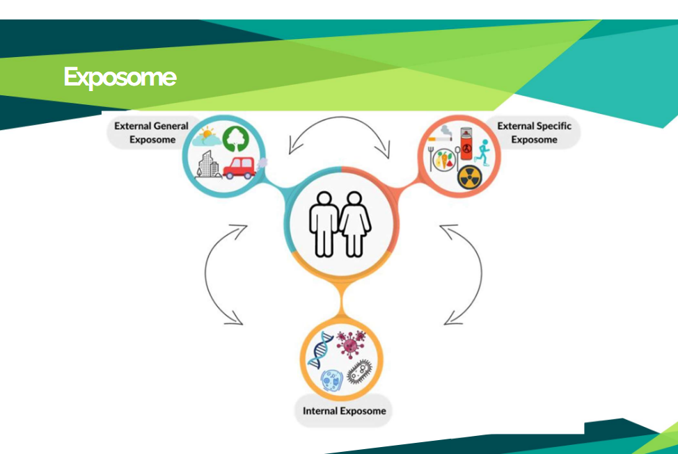

# Team7_Epigenomics_Harmonization_Exposome
Here’s how you can add this problem statement and the related information **with an illustrative image** to your `README.md` using Markdown:

```markdown
# The Challenge

**How do we connect multiple disparate data types to obtain a meaningful understanding of the biological functions of an organism?**

## Publicly Available Epigenomic and Exposome Data Sets

### 🔬 Exposome Data Sets
- **Exposome Correlation and Interpretation Database (ECID):** 250 publicly available datasets sourced from:
  - NHANES (National Health and Nutrition Examination Survey)
  - HHEAR
  - Metabolomics WorkBench
  - EBI Metabolights
  - ECHO  
- **NHANES:** Temporal `.xpt` files available for download

### 🧬 Epigenomic Datasets / Databases
- **ENCODE:** Python-wrapped datasets available (high-throughput sequencing)
- **GEO (Gene Expression Omnibus):** DNA methylation datasets
- **The Cancer Genome Atlas (TCGA):** Methylation array profiles


```


